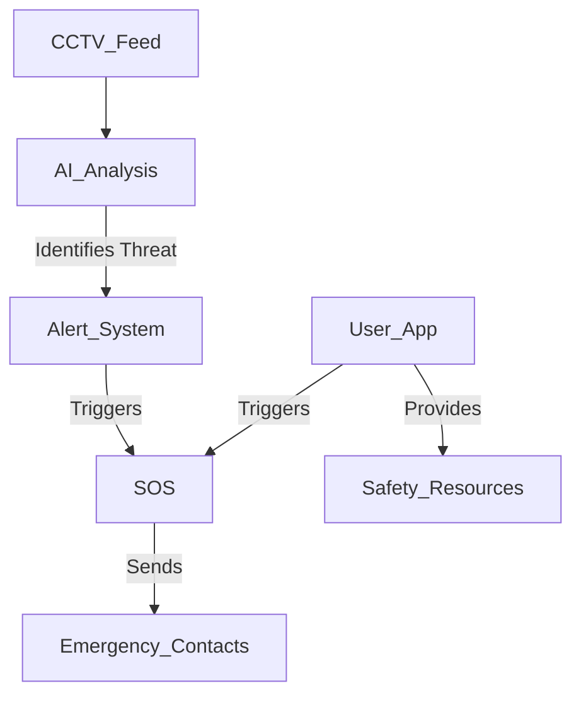

# 🚀 Project N: Women Safety and Analytics Tool  
**By Team Adyant**  

[](LICENSE)  
[](https://www.python.org/)  
[](https://docs.openvino.ai/latest/index.html)  
[](https://opencv.org/)  

### 📌 Introduction  
Women's safety is not just an issue—it's a necessity. **Project N** is an AI-driven **Women Safety and Analytics Tool** designed to proactively monitor and assist in distress situations. Existing solutions primarily focus on post-incident responses, leaving victims vulnerable. **Project N bridges this gap** with real-time intervention using **AI-based smart surveillance and a user-side mobile & web application.**  

### 🌟 Features  
🔹 **Smart Surveillance System** (Proactive Monitoring)  
- AI-powered **gender detection, crowd analysis, and SOS gesture recognition**.  
- Identifies lone women or those in potentially unsafe environments.  
- Uses **OpenVINO™, OpenCV, and Intel Zoo models** for real-time analysis.  
- **Gesture-based distress recognition** (Thumb & Pinky Sign) for silent SOS activation.  

🔹 **User-Side Mobile & Web Application** (Immediate Assistance)  
- **SOS trigger button** with multilingual support for accessibility.  
- **Real-time geolocation tracking** for emergency responders.  
- **Community support hub** with legal resources and assistance.  
- **Automated emergency alerts** via SMS using **Twilio API**.  

---

## 🛠️ Technical Implementation  

🔹 **Computer Vision Models**  
- **Face & Gender Detection:** Uses **pre-trained deep learning models** (`age_net.xml`, `gender_net.xml`) for classification.  
- **Contour-Based Gesture Recognition:** Detects distress signals for silent SOS activation.  
- **Crowd Density Analysis:** Identifies high-risk scenarios and triggers alerts accordingly.  

🔹 **Alert Mechanism**  
- **Real-Time Location Tracking:** Uses **Geocoder & Nominatim** for precise location detection.  
- **Automated Emergency Notifications:** Sends alerts via **Twilio API** to emergency contacts.  
- **Loud Alarm Activation:** Uses **Winsound** for instant audio alerts.  
- **Context-Aware Alert System:** Prevents duplicate SOS triggers to reduce false alarms.  

---

## ⚙️ System Architecture  



- **AI-Driven Monitoring:** CCTV feeds are analyzed in real-time.  
- **Automated Alerts:** Once a distress situation is detected, alerts are sent instantly.  
- **User-Side App:** Users can manually trigger SOS and access safety resources.  

---

## 🎯 Impact & Feasibility  

✅ **Cost-Effective & Scalable** – Works with **existing CCTV infrastructure & smartphones**, reducing additional costs.  
✅ **Low Latency & Real-Time Processing** – AI models operate in **~36.79ms per frame**, ensuring instant response.  
✅ **Minimal Infrastructure Requirements** – Compatible with **Intel CPUs, GPUs, and VPUs**.  
✅ **Reliable & Context-Aware** – Reduces false alarms with intelligent **gesture-based SOS activation**.  
✅ **Proactive Threat Detection** – Detects potential risks before escalation.  
✅ **User Empowerment** – Offers **multilingual chatbots, legal resources, and a safety hub**.  
✅ **Social & Policy Impact** – Supports urban safety initiatives and law enforcement assistance.  

---

## 📂 Repository Structure  

```
├── .ipynb_checkpoints
├── intel/                # AI models & pre-trained deep learning files
│   ├── age_net.xml
│   ├── gender_net.xml
│   ├── person-detection-retail-0013.xml
│   ├── face-detection-adas-0001.xml
│   ├── ...
├── Adyant.ipynb          # Jupyter Notebook with AI model implementation
├── requirements.txt      # Dependencies for the project
├── README.md             # Project documentation
└── LICENSE               # License file
```

---

## 📌 Installation & Setup  

### 1️⃣ Clone the Repository  
```sh
git clone https://github.com/hiyaamalik/women-safety-pn-optimised.git
cd women-safety-pn-optimised
```

### 2️⃣ Install Dependencies  
```sh
pip install -r requirements.txt
```

### 3️⃣ Run the AI Model  
```sh
jupyter notebook
```
- Open **Adyant.ipynb** and execute the notebook.  


---

## 📜 License  
This project is licensed under the **Apache 2.0**. See the [LICENSE](LICENSE) file for details.  

---

## ⭐ Support & Contributions  
🌟 If you like this project, **give it a star!**  
🚀 Contributions are welcome! Feel free to fork and submit PRs.  

